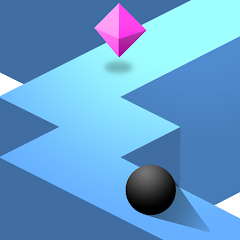

<h1 align="center"> ZigZag Clone (Ketchapp) </h1>  

  

  This is project is clone of ZigZag game with Unity developed by Ketchapp Game Studio.

 

 

## Gameplay

 

  

## Tools

Technologies I use in the game:

* New Input System
* Cinemachine
* Universal Render Pipeline (URP)

 

